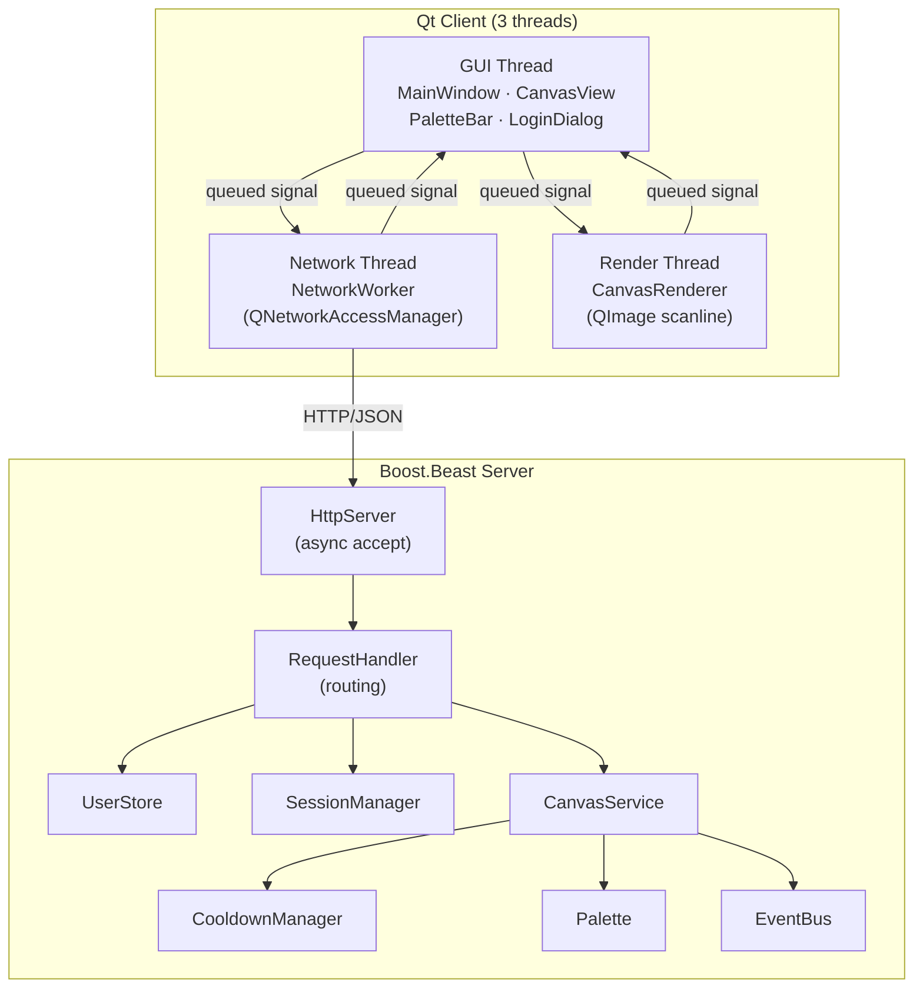

<p align="center">
  <h1 align="center">CppPlace</h1>
  <p align="center">
    A collaborative pixel-art canvas — inspired by Reddit's r/place.
    <br />
    Built with <strong>C++17</strong>, <strong>Boost.Beast</strong>, and <strong>Qt 6</strong>.
  </p>
</p>

<p align="center">
  
  
  
  
  
</p>

---

## Overview

CppPlace is a real-time collaborative canvas where multiple users can place colored pixels on a shared grid. Each user can set one pixel at a time with a configurable cooldown between placements. The project demonstrates:

- **Multi-threaded server** — Boost.Beast HTTP server with per-connection threading and thread-safe services
- **Multi-threaded Qt client** — three-thread architecture (GUI / network / rendering)
- **Clean architecture** — layered design with dependency injection, `Result<T>` error handling, and full separation of concerns
- **Comprehensive testing** — unit tests (GoogleTest), integration tests (QTest + in-process server)

## Architecture



## Features

| Feature | Details |
|---------|---------|
| 🎨 Shared canvas | Configurable N×M pixel grid with a 16-color palette |
| 👤 Auth | Registration and login with hashed passwords and session tokens |
| ⏳ Cooldown | Per-user placement cooldown (configurable, default 5 min) |
| 🔄 Live sync | Periodic polling keeps all clients in sync |
| 🔍 Zoom & Pan | `Ctrl+Wheel` to zoom (1–32×), right-click drag to pan |
| 🖱️ Pixel hover | Corner-bracket cursor highlights the pixel under the mouse |
| 🌙 Dark theme | QSS-based dark UI with warm accent color |
| 💾 Persistence | Binary canvas snapshots survive server restarts |

## Quick Start

### Prerequisites

- **CMake** ≥ 3.20
- **C++17** compiler (MSVC 2022, GCC 11+, or Clang 14+)
- **Boost** ≥ 1.74 (auto-fetched if not found)
- **Qt 6.2+** with Widgets and Network modules (optional — client only)

### Build

```bash
# Configure (set Qt path if building the client)
cmake -B build -DCMAKE_PREFIX_PATH=/path/to/Qt/6.x.x/gcc_64

# Build everything
cmake --build build

# Run server tests
ctest --test-dir build --output-on-failure
```

### Run

```bash
# Start server (defaults: port 8080, canvas 1000×1000, cooldown 300s)
./build/cppplace_server [port] [width] [height] [cooldown_sec]

# Start client (connects to localhost:8080 by default)
./build/cppplace_client -s http://127.0.0.1:8080
```

## Project Structure

```
CppPlace/
├── src/
│   ├── client/             # Qt 6 desktop client
│   │   ├── MainWindow      # Main window, thread orchestration
│   │   ├── NetworkWorker   # HTTP client (own thread)
│   │   ├── CanvasRenderer  # Pixel → QImage (own thread)
│   │   ├── CanvasView      # Interactive canvas widget
│   │   ├── PaletteBar      # Color picker strip
│   │   ├── LoginDialog     # Login / register dialog
│   │   ├── ClientPalette   # 16-color palette definition
│   │   └── resources/      # QSS theme + .qrc
│   ├── server/             # Boost.Beast HTTP server
│   │   ├── HttpServer      # Async acceptor, per-connection threads
│   │   └── RequestHandler  # REST endpoint routing
│   ├── services/           # Business logic
│   │   ├── CanvasService   # Canvas operations + validation
│   │   ├── UserStore       # Registration + authentication
│   │   ├── SessionManager  # Token-based sessions
│   │   ├── CooldownManager # Per-user placement throttle
│   │   ├── Palette         # Server-side palette
│   │   ├── EventBus        # Pub/sub for canvas events
│   │   └── PersistenceService # Binary save/load
│   ├── models/             # Domain models (Canvas, Pixel, User)
│   ├── common/             # Shared utilities (Result<T>, ErrorCode)
│   └── utils/              # PasswordHasher, TokenGenerator
├── tests/
│   ├── *.cpp               # Server unit tests (GoogleTest)
│   └── client/             # Client tests (QTest)
├── docs/                   # Requirements & documentation
├── CMakeLists.txt
└── .github/workflows/      # CI pipeline
```

## API Reference

| Method | Endpoint | Auth | Description |
|--------|----------|------|-------------|
| `POST` | `/api/register` | — | Register a new user `{username, password}` → `{token}` |
| `POST` | `/api/login` | — | Login `{username, password}` → `{token}` |
| `POST` | `/api/logout` | Bearer | Invalidate session |
| `GET` | `/api/canvas` | — | Get canvas state `{width, height, online, pixels[]}` |
| `POST` | `/api/pixel` | Bearer | Place a pixel `{x, y, color_index}` |

## Testing

```bash
# Server tests (GoogleTest) — unit + concurrency
cmake --build build --target cppplace_tests
ctest --test-dir build -R cppplace_tests

# Client tests (QTest) — renderer + network integration
cmake --build build --target cppplace_client_tests
ctest --test-dir build -R cppplace_client_tests
```

**Server tests** cover: canvas operations, palette validation, cooldown logic, session management, user store, persistence, event bus, password hashing, and thread safety under concurrent access.

**Client tests** cover: renderer threading, palette mapping, pixel scaling, single-pixel patching, bad input rejection, network worker threading, full register→fetch→place round-trip against an in-process server, and authentication failure handling.

## License

This project is licensed under the [MIT License](LICENSE).
